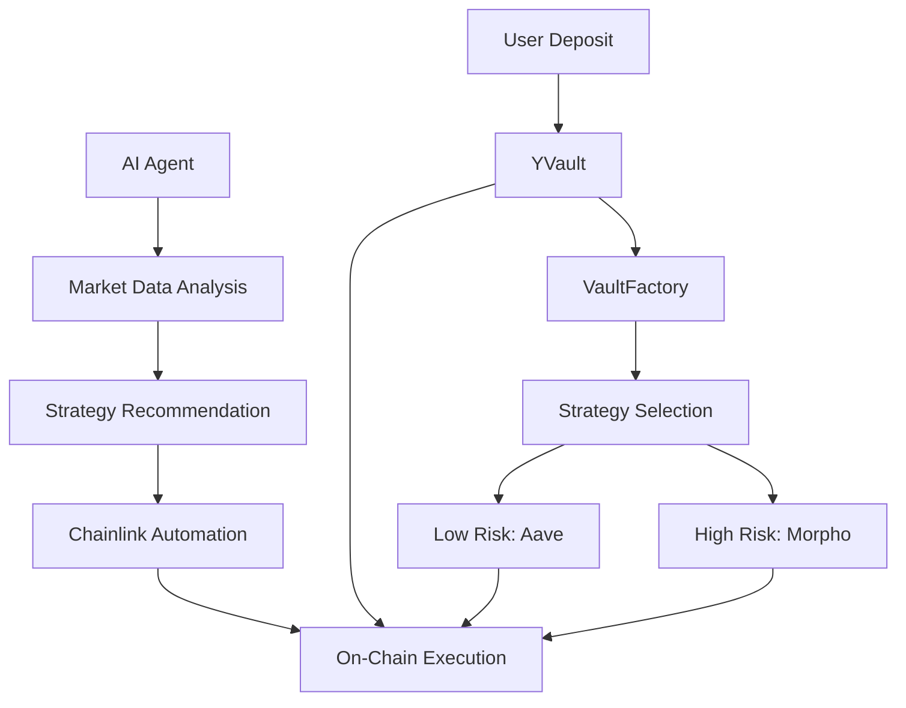

# Yield Optimizer Protocol

<div align="center">


**AI-Powered DeFi Yield Optimization Protocol**

*Intelligently allocates user capital across DeFi strategies using off-chain AI agents and Chainlink Automation*

[🏗️ Architecture](#-architecture) • [🚀 Quick Start](#-quick-start) • [📚 Documentation](#-documentation) • [🧪 Testing](#-testing) • [🔒 Security](#-security)

</div>

---

## 📖 Overview

The **Yield Optimizer Protocol** is a sophisticated DeFi platform that combines the power of artificial intelligence with blockchain automation to optimize yield generation across multiple DeFi strategies. Built on Ethereum with ERC4626-style vaults, the protocol intelligently allocates user capital based on risk preferences and real-time market conditions.

### 🌟 Key Features

- **🧠 AI-Powered Strategy Selection**: Off-chain AI agent analyzes market data from CoinGecko, DeFiLlama, and protocol APIs
- **⚙️ Chainlink Automation**: Automated on-chain execution of AI recommendations
- **🎯 Risk-Based Allocation**: Support for Low Risk (Aave) and High Risk (Morpho/Curve) strategies
- **🔒 Security-First Design**: Multi-sig admin controls, reentrancy protection, and emergency pause functionality
- **📊 Real-Time Market Analysis**: Dynamic strategy selection based on APY trends and market conditions

---

## Deployed Contracts (Sepolia)
```
   MockAavePool: 0x6deb956da4300Fe538efB475D05e818e7D4F3699
   MockMorpho: 0x779D4755eF3574467Da5B4909629106794A9dd28
   VaultFactory: 0xd0954eA81Aa99f320C0cB2A6703e1319c196441c
   LowRiskVault: 0xb32a6FF65dcC2099513970EA5c1eaA87fe564253
   HighRiskVault: 0x721bF349E453cbFB68536d3a5757A70B74D84279
   Low Vault Owner: 0xcdd0a2f1Ed2Fcf90486f510F85d9fc1249C21D2e
   High Vault Owner: 0x204554c6B13f436a30e77B986de525f436b7Cf1C

   LowRiskStrategy: 0x5E7F3A1b83ecC5Bed41F8CC2b13DcD75BeD525Ee
   HighRiskStrategy: 0xBf84a91eDD1455b7Df150038F2004d00C27ef5c0
   USDC_SEPOLIA = 0x1c7D4B196Cb0C7B01d743Fbc6116a902379C7238
```

## Chainlink Autoamtion Upkeep

https://automation.chain.link/sepolia/371634965542298094432024965539145112188713635505165377177798693816686038288
https://automation.chain.link/sepolia/6159270574854941854967137437462153565675183198460466722719413083942550900961

## 🏗️ Architecture

### Core Components



### 1. YVault (Yearn V2-Style Vault)

**Location**: `src/Contracts/Vaults/YVault.sol`

The core vault contract implementing ERC4626-like functionality:

- **Asset Management**: Accepts USDC deposits and tracks user shares
- **Strategy Integration**: Routes funds to active yield strategies
- **Security Features**: Reentrancy protection, admin controls, emergency pause
- **Automation Ready**: Chainlink keeper integration for automated execution

### 2. VaultFactory

**Location**: `src/Contracts/Vaults/VaultFactory.sol`

- **Dynamic Deployment**: Creates vaults based on risk profiles
- **Strategy Association**: Links vaults with appropriate strategies at creation
- **Registry Management**: Tracks all deployed vault instances

### 3. Strategy Contracts

- **LowRiskAaveStrategy.sol**: For conservative users, integrates with mock Aave pool.
- **HighRiskMorphoStrategy.sol**: For aggressive users, integrates with mock Morpho pool.
- **MockStrategy.sol**: For testing vault mechanics.

### 4. AI Agent (ElizaOS)

**Location**: `eliza-ai-agent/`

- **Data Sources**: CoinGecko, DeFiLlama, Aave/Morpho APIs
- **Analysis**: Market trend analysis, APY comparison, risk assessment
- **Output**: Strategy recommendations stored in ElizaOS KV store
- **Integration**: Seamless connection with Chainlink Automation

### 5. Chainlink Automation

**Location**: `src/ChainlinkIntegration/YVaultKeeper.sol`

- **Trigger**: Scheduled or event-based strategy execution
- **Security**: Role-based access control for automation functions
- **Integration**: Direct connection with AI agent recommendations

---

## 🚀 Quick Start

### Prerequisites

- **Foundry**: `curl -L https://foundry.paradigm.xyz | bash`
- **Node.js**: Version 18+ 
- **Git**: Latest version
- **Ethereum Node**: Access to Ethereum mainnet/testnet

### Installation

1. **Clone the Repository**
    ```bash
    git clone https://github.com/your-username/yield-optimizer-prod.git
    cd yield-optimizer-prod
    ```

2. **Install Dependencies**
    ```bash
    # Install Foundry dependencies
    forge install

    # Install Node.js dependencies
    npm install

    # Install ElizaOS agent dependencies
    cd eliza-ai-agent
    npm install
    cd ..
    ```

3. **Environment Setup**
    ```bash
    cp .env.example .env
    # Configure your environment variables
    ```

### Local Development

1. **Build Contracts**
    ```bash
    forge build
    ```

2. **Run Tests**
    ```bash
    forge test
    ```

3. **Start AI Agent**
    ```bash
    cd eliza-ai-agent
    npm run dev
    ```

4. **Deploy to Local Network**
    ```bash
    anvil
    forge script script/DeployAll.s.sol --rpc-url http://localhost:8545 --broadcast
    ```

---

## 🧪 Testing

- **Unit Tests**: Individual contract functionality
- **Integration Tests**: Cross-contract interactions
- **Fuzz Tests**: Randomized input testing
- **Edge Cases**: Boundary conditions and error scenarios

```bash
forge test
forge coverage
```

---

## 🔒 Security

- **Reentrancy Protection**: `nonReentrant` modifiers on critical functions
- **Multi-Sig Admin**: Role-based access control for administrative functions
- **Emergency Pause**: Ability to pause protocol operations
- **Token Recovery**: Admin functions to recover mistakenly sent tokens
- **Safe Math**: OpenZeppelin SafeERC20 for secure token operations

---

## 📚 Documentation

- **[YVault](./src/Contracts/Vaults/YVault.sol)**: Core vault implementation
- **[VaultFactory](./src/Contracts/Vaults/VaultFactory.sol)**: Vault deployment factory
- **[Strategies](./src/Contracts/Strategies/)**: Yield generation strategies
- **[Interfaces](./src/Interfaces/)**: Contract interfaces and standards
- **[AI Agent API](./eliza-ai-agent/)**: ElizaOS agent documentation
- **[Chainlink Integration](./src/ChainlinkIntegration/)**: Automation setup guide

---

## 🚀 Deployment

### Mainnet Deployment

```bash
export PRIVATE_KEY=your_private_key
export RPC_URL=your_rpc_url
export ETHERSCAN_API_KEY=your_etherscan_key

forge script script/DeployAll.s.sol --rpc-url $RPC_URL --broadcast --verify
```

### Testnet Deployment

```bash
forge script script/DeployAll.s.sol --rpc-url $SEPOLIA_RPC_URL --broadcast --verify
```

---

## 🤝 Contributing

- Fork the Repository
- Create a Feature Branch
- Make Changes
- Add Tests
- Submit Pull Request

---

## 📄 License

This project is licensed under the MIT License - see the [LICENSE](LICENSE) file for details.

---

## 🙏 Acknowledgments

- **Yearn Finance**: Inspiration for vault architecture
- **Chainlink**: Automation infrastructure
- **ElizaOS**: AI agent framework
- **OpenZeppelin**: Security libraries and best practices

---

## 📞 Contact

- **Website**: [https://nagatejakachapuram.github.io/yield-optimizer-prod/](https://nagatejakachapuram.github.io/yield-optimizer-prod/)
- **GitHub**: [https://github.com/your-username/yield-optimizer-prod](https://github.com/your-username/yield-optimizer-prod)
- **Discord**: [Join our community](https://discord.gg/yield-optimizer)
- **Email**: contact@yield-optimizer.com

---

<div align="center">

**Built with ❤️ by the Yield Optimizer Team**


</div>
