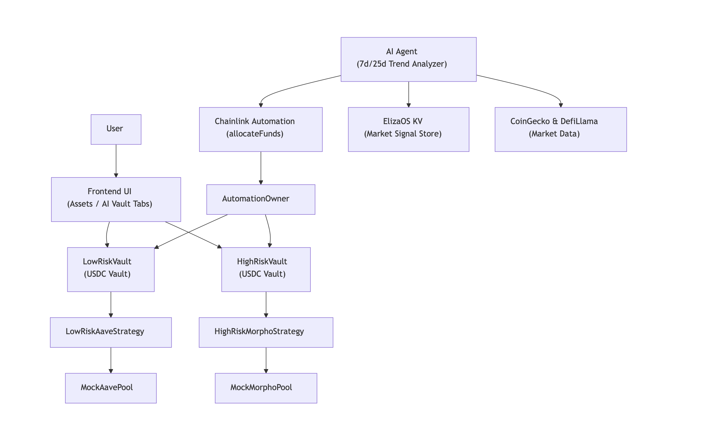

-----

# 🏛️ Protocol Architecture Overview

The YVault protocol is designed with a robust architecture that seamlessly integrates off-chain intelligence with on-chain execution. This is achieved through the strategic connection of off-chain and on-chain components, primarily orchestrated by **Chainlink Automation** and a permissioned **`AutomationOwner`** controller contract.

-----

## 📊 Architecture Diagram

-----

##  Key Contracts

The on-chain functionality of the protocol is driven by these core smart contracts:

### `YVault`

  * **Standard Compliance:** An ERC-4626 compliant vault designed specifically for USDC.
  * **Functionality:** Handles all aspects of asset management, including accepting user deposits, minting and issuing vault shares, and crucially, managing the allocation of deposited funds to the active strategy.

### Strategy Contracts

  * **Interface:** Each strategy contract adheres to the `IStrategy` interface, implementing the `execute(address user, uint256 amount)` function.
  * **`LowRiskAaveStrategy`:** An example strategy designed to lend deposited USDC into stable, low-risk markets on Aave.
  * **`HighRiskMorphoStrategy`:** An example strategy focused on allocating funds to higher-risk, potentially higher-yield opportunities, such as those found on Morpho Blue or certain Curve-like vaults.

### `AutomationOwner`

  * **Controller Role:** This contract acts as the sole authorized entity responsible for calling sensitive vault functions, specifically `setStrategy()`.
  * **Permissioned Access:** It is the only address granted permission to be called by Chainlink Automation, serving as a secure gateway for off-chain commands.

### `VaultFactory`

  * **Deployment:** A utility contract responsible for deploying new `YVault` instances.
  * **Initialization:** During deployment, the `VaultFactory` sets the initial active strategy for the new vault and assigns the designated `AutomationOwner` address.

## 💻 Off-Chain Components

These external components provide the intelligence and automation necessary for dynamic vault management:

### AI Agent (Built with ElizaOS)

  * **Data Aggregation:** Gathers comprehensive DeFi market data from various sources including Aave, Curve, CoinGecko, and others.
  * **Market Analysis:** Classifies market trends (e.g., bullish, bearish, volatile, flat) and intelligently selects the most suitable liquidity pool or protocol for each specific strategy type (e.g., low risk, high risk).
  * **Decision Storage:** Stores its calculated optimal strategy decisions within the ElizaOS Key-Value (KV) store, making them accessible to other components.

### Chainlink Automation

  * **Trigger Mechanism:** Regularly monitors the ElizaOS KV store for updated market signals and strategy decisions.
  * **On-Chain Execution:** Upon detecting a new signal or on a predefined schedule, it securely calls the `AutomationOwner.updateVaultStrategy(vault, strategy)` function on-chain, initiating the vault's strategy change.

## ✅ Benefits of `AutomationOwner`

The inclusion of the `AutomationOwner` contract provides several architectural advantages:

  * **Clean Separation of Authority:** Clearly delineates responsibilities, ensuring that direct control over `YVault`'s critical functions is abstracted away from external automation.
  * **Enhanced Security:** Provides a safer mechanism than granting Chainlink Automation direct access to sensitive vault functions. It acts as a single, auditable choke point for external commands.
  * **Centralized Override/Fallback:** Offers a potential point for centralized intervention or a fallback mechanism if automated processes need to be paused or manually adjusted in emergencies.

-----

For an in-depth look at the AI agent's functionality and decision-making process, please refer to the [ai-agent.md](ai-agent.md) documentation. To explore the smart contract functions and their usage, consult the [api.md](api.md) guide.